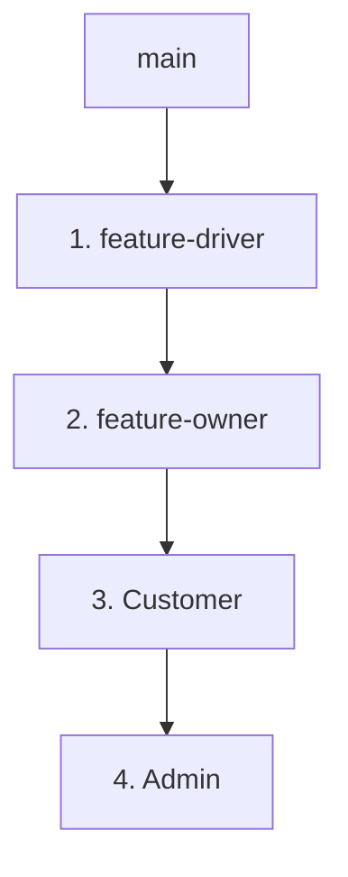

# Lanka Renters - Git Integration Workflow Plan

This document outlines the recommended Git workflow, merge sequence, database migration strategy, and conflict prevention rules for integrating Lanka Renters' modules.

---

## 1. Branch Taxonomy & Purpose

* **`main`**: The single source of truth for stable integration. All releases are deployed from this branch. No direct commits allowed.
* **`feature-driver`**: Isolated workspace for implementing Driver-specific CRUD flows, document uploads, leaves logs, and pre-trip checklists.
* **`feature-owner`**: Isolated workspace for vehicle owner profile listings and pairing connection requests.
* **`Customer`**: Isolated workspace for customer vehicle browsing, booking creations, and chat communications.
* **`Admin`**: Isolated workspace for overall platform configuration, document verification approvals, and leaves reviews.

---

## 2. Safe Merge Order Strategy

To prevent integration overlaps and simplify debug tasks, features should be integrated into `main` sequentially, prioritizing lower dependency profiles first:



### Sequence Rationale:
1. **`feature-driver` (First)**: Highly isolated from other views, holds core schemas (like bookings lookup checks and payments) that other modules rely upon.
2. **`feature-owner` (Second)**: Relies on `feature-driver` pairing options. Merging it second resolves `driver_owner_links` constraints easily.
3. **`Customer` (Third)**: Core bookings generation depends on driver availability checks.
4. **`Admin` (Fourth)**: Integrates verification tools and leave approval metrics that inspect driver/customer/owner tables.

---

## 3. Integration Branch Strategy

Instead of merging feature branches directly into `main`, developers should use an **Integration Branch** (`staging` or `integration`) to run checks:

1. Create an integration branch:
   ```bash
   git checkout -b integration main
   ```
2. Merge `feature-driver` first, resolve conflicts, and run tests.
3. Merge `feature-owner`, resolve conflicts, and run tests.
4. Repeat for `Customer` and `Admin`.
5. Once all integration checks succeed, merge `integration` into `main`:
   ```bash
   git checkout main
   git merge integration
   ```

---

## 4. Conflict Prevention Rules

* **Pull Before Working**: Always run `git pull origin main` before starting edits.
* **Merge Base (main) Locally**: Keep your branch up to date by merging `main` into your local feature branch weekly:
   ```bash
   git checkout feature-driver
   git merge origin/main
   ```
* **No Direct main Commits**: Under no circumstances should direct commits be pushed to `main`. All additions must go through staging pull requests.
* **No Force Pushing**: Never run `git push --force` on shared remote branches.

---

## 5. Database Migration Strategy

Since multiple branches alter `database/lanka_renters.sql`, follow this schema integration process:
* **DDL Isolation**: Do not alter columns of other modules.
* **Append Alterations**: Place new tables and column additions at the end of the SQL file.
* **Staged Migrations**: When combining branches, developers must check for column additions, merge them sequentially in the physical schema script, and run incremental `ALTER` queries on the database rather than dropping tables.

---

## 6. Shared File Handling Strategy

* **Authentication Helper (`app/helpers/AuthHelper.php`)**:
  - Keep security helpers generic.
  - Coordinate additions (like CSRF functions) with other team members before committing.
* **Real-time Messaging (`app/controllers/ChatController.php`)**:
  - Ensure endpoint parameters remain generic (using `user_id` instead of role-locked IDs).
* **CSS Assets (`public/assets/css/`)**:
  - Place module-specific styles inside local sheets (e.g., `public/driver/assets/css/driver.css` or inside view style blocks) to prevent global CSS style overwrites.
