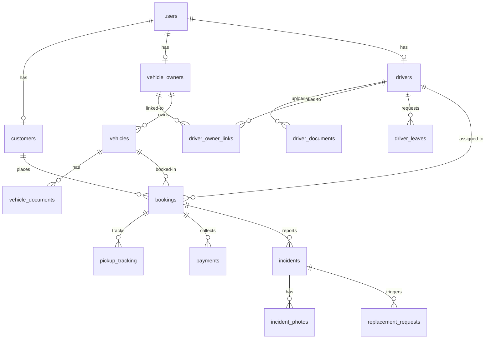

# Lanka Renters Database Documentation

This document describes the unified relational database schema, table structures, relationship cardinalities, status enums, and team migration guidelines.

---

## Entity Relationship Overview

---

## Tables Description

### 1. `users` (Central Authentication)
* `id` (INT, PK)
* `name` (VARCHAR)
* `email` (VARCHAR, UNIQUE)
* `password_hash` (VARCHAR)
* `phone` (VARCHAR)
* `role` (ENUM: 'customer', 'owner', 'driver', 'admin')
* `status` (ENUM: 'active', 'inactive', 'suspended', 'pending')

### 2. `drivers`
* `id` (INT, PK)
* `user_id` (INT, FK references `users.id`)
* `availability_status` (ENUM: 'available', 'busy', 'off_duty')
* `rating_avg` (DECIMAL)
* `address` (TEXT)
* `emergency_contact` (VARCHAR)

### 3. `driver_documents` (With Versioning & History Support)
* `id` (INT, PK)
* `driver_id` (INT, FK references `drivers.id`)
* `document_type` (ENUM: 'nic', 'driving_license', 'police_report')
* `document_number` (VARCHAR)
* `expiry_date` (DATE)
* `file_path` (VARCHAR)
* `version` (INT, defaults to 1)
* `status` (ENUM: 'pending', 'approved', 'rejected', 'superseded', 'expired')
* `is_current` (BOOLEAN, defaults to TRUE)
* `reviewed_by` (INT, FK references `users.id` NULL)
* `reviewed_at` (TIMESTAMP NULL)
* `rejection_reason` (TEXT NULL)

### 4. `profile_change_requests`
* `id` (INT, PK)
* `user_id` (INT, FK references `users.id`)
* `field_name` (VARCHAR: 'phone', 'address', 'emergency_contact')
* `old_value` (TEXT)
* `requested_value` (TEXT)
* `status` (ENUM: 'pending', 'approved', 'rejected')
* `reason` (TEXT)
* `reviewed_by` (INT, FK references `users.id` NULL)
* `reviewed_at` (TIMESTAMP NULL)
* `rejection_reason` (TEXT NULL)

### 5. `account_change_requests`
* `id` (INT, PK)
* `user_id` (INT, FK references `users.id`)
* `change_type` (ENUM: 'username', 'email')
* `old_value` (VARCHAR)
* `requested_value` (VARCHAR)
* `status` (ENUM: 'pending', 'approved', 'rejected')
* `reviewed_by` (INT, FK references `users.id` NULL)
* `reviewed_at` (TIMESTAMP NULL)
* `rejection_reason` (TEXT NULL)

### 6. `admin_reviews`
* `id` (INT, PK)
* `admin_id` (INT, FK references `users.id`)
* `request_type` (ENUM: 'profile_change', 'account_change', 'document_replacement', 'police_report')
* `request_id` (INT)
* `action` (ENUM: 'approved', 'rejected')
* `comments` (TEXT)

---

## Migration Setup & Guidelines
1. All changes must be written inside the `database/migrations/` subfolder as new SQL files prefixed with a sequence number (e.g. `006_custom_alters.sql`).
2. Run migrations locally on your active database.
3. Update `database/schema.sql` to match.
